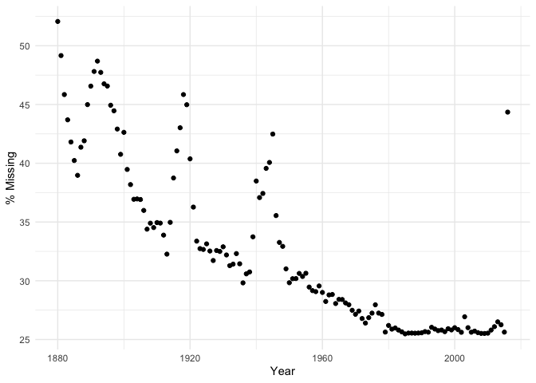
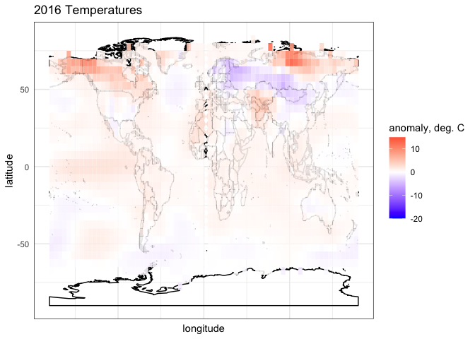

Climate Visualizations
================

### Intoduction

``` r
library(maptools) #the maptools library will be used to generate the world map to plot over
data("wrld_simpl") 
library(tidyverse)

climate <- read_csv('climate.csv')
```

The original dataset is 59,223 rows and 75 columns. Missing values are
represented at -9999

``` r
climate[1:7, 1:7]
```

    ## # A tibble: 7 x 7
    ##    year month lat    lon_175_180W lon_170_175W lon_165_170W lon_160_165W
    ##   <dbl> <dbl> <chr>         <dbl>        <dbl>        <dbl>        <dbl>
    ## 1  1880     1 85-90N        -9999        -9999        -9999        -9999
    ## 2  1880     1 80-85N        -9999        -9999        -9999        -9999
    ## 3  1880     1 75-80N        -9999        -9999        -9999        -9999
    ## 4  1880     1 70-75N        -9999        -9999        -9999        -9999
    ## 5  1880     1 65-70N        -9999        -9999        -9999        -9999
    ## 6  1880     1 60-65N        -9999        -9999        -9999        -9999
    ## 7  1880     1 55-60N        -9999        -9999        -9999        -9999

## Missing Values

Lets see how many missing values we have and whether they are constant
across time

``` r
climate <- climate %>% 
              mutate(date = str_c(year, month, 1, sep= '-')) #this column will be useful when we attempt to plot data across time

climate[climate == -9999] <- NA 

null_df <- data.frame(is.na(climate[, 4:75])) #create boolean array to count missing values
null_df <- cbind(year=climate$year, null_df) 

null_long <- null_df %>% pivot_longer(cols = 2:73, names_to = 'column', values_to= 'isnull') #convert to long format

null_by_year <- null_long %>% group_by(year) %>% dplyr::summarise(percent_null = mean(isnull)*100) #average amount of null values per year

ggplot(data=null_by_year, aes(x=year, y=percent_null)) +geom_point() + theme_minimal() + labs(x= 'Year', y= '% Missing')
```

<!-- -->

## Data Cleaning and Prep

It is clear from the graph above that the data has become more complete
over time. The data completeness was sporadic prior to the 1950s but has
become very consistent since. The outlier in the final year in which
data was provided (2016) is due to it being an incomplete year at the
time the data was formed. We could remove this year but since the data
is already adjusted based on the location and month we will leave it as
is.

Well convert the original data frame to long format so that each row is
made up of a unique combination of date, latitude, and longitude values.
We will remove rows with missing values and separate the latitude and
longitude values into.

``` r
climate <- climate %>%
          pivot_longer(cols = 4:75, names_to = "lon", values_to = 'temp') %>% #convert to long format
          filter(temp != -9999) %>%
          mutate(latlon = str_c(lat, lon, sep=' ' )) %>% #this coordinate key will be useful later as we group by location
          mutate(temp= temp/100) %>% #convert temperature from hundredths of degrees Celsius to the more common, degrees Celsius
          separate(col=lon, into=c('scrap', 'lon1', 'lon2'),  remove=TRUE ) %>% 
          separate(col=lat, into=c('lat1', 'lat2'),  remove=TRUE ) %>% 
  
          select(-scrap)

head(climate)
```

    ## # A tibble: 6 x 9
    ##    year month lat1  lat2  date     lon1  lon2   temp latlon           
    ##   <dbl> <dbl> <chr> <chr> <chr>    <chr> <chr> <dbl> <chr>            
    ## 1  1880     1 75    80N   1880-1-1 10    15E   -0.5  75-80N lon_10_15E
    ## 2  1880     1 70    75N   1880-1-1 50    55W   -1.39 70-75N lon_50_55W
    ## 3  1880     1 70    75N   1880-1-1 0     5E     0.02 70-75N lon_0_5E  
    ## 4  1880     1 70    75N   1880-1-1 5     10E   -0.1  70-75N lon_5_10E 
    ## 5  1880     1 70    75N   1880-1-1 10    15E   -0.2  70-75N lon_10_15E
    ## 6  1880     1 70    75N   1880-1-1 15    20E    0.16 70-75N lon_15_20E

## Introductory Visualizations

Here we will visualize how global temperatures have been trending since
the 1880s.

``` r
monthly <- climate %>% group_by(date) %>% summarise(avg_deviance = mean(temp))

mid = mean(monthly$avg_deviance)

ggplot(data=monthly, 
       aes(x=date, y=avg_deviance, color= avg_deviance )) +
       geom_point() + 
       labs(title= 'Average Global Temperature', 
                 x='1880 - 2016', 
                 y= 'Average Global Temperature Deviance =(°C))') + 
       theme(
                axis.text.x = element_blank(),
                axis.ticks = (element_blank())) +

        scale_color_gradient2(low='blue', mid='orange', high='red', midpoint = mid)
```

<!-- -->

## Refining Coordinates

To be able to plot our coordinates onto a world map they will need to be
in numerical format, converting northern and eastern coordinates to
positive numericals and Southern and Western coordinates to negative
numericals.

``` r
climate <- climate %>%
          mutate(lon2 = if_else(str_sub(lon2, -1) == 'E',
                                str_sub(lon2, start=1, end=-2), #if East leave as positive and remove the 'E'
                                paste('-', (str_sub(lon2, start=1, end=-2)), sep=''))) %>% # if West convert to negative and remove the 'W'
  
          mutate(lat2 = if_else(str_sub(lat2, -1) == 'N',
                                str_sub(lat2, start=1, end=-2), #if North leave as positive and remove the 'N'
                                paste('-', (str_sub(lat2, start=1, end=-2)), sep=''))) %>% # if South convert to negative and remove the 'S'

          mutate(lon2 = as.numeric(lon2),
                 lat2 = as.numeric(lat2),
                 lat1 = if_else(lat2 >= 0, lat2 - 5, lat2+5), 
                 lon1 = if_else(lon2 >= 0, lon2 - 5, lon2+5))
```

``` r
climate <- climate %>% pivot_longer(cols= c('lat1', 'lat2'), names_to = 'lat_number', values_to= 'lat') %>%
                       pivot_longer(cols= c('lon1', 'lon2'), names_to = 'lon_number', values_to= 'lon') 
                     # select(-scrap, -scrap2)
head(climate)
```

    ## # A tibble: 6 x 9
    ##    year month date      temp latlon            lat_number   lat lon_number   lon
    ##   <dbl> <dbl> <chr>    <dbl> <chr>             <chr>      <dbl> <chr>      <dbl>
    ## 1  1880     1 1880-1-1 -0.5  75-80N lon_10_15E lat1          75 lon1          10
    ## 2  1880     1 1880-1-1 -0.5  75-80N lon_10_15E lat1          75 lon2          15
    ## 3  1880     1 1880-1-1 -0.5  75-80N lon_10_15E lat2          80 lon1          10
    ## 4  1880     1 1880-1-1 -0.5  75-80N lon_10_15E lat2          80 lon2          15
    ## 5  1880     1 1880-1-1 -1.39 70-75N lon_50_55W lat1          70 lon1         -50
    ## 6  1880     1 1880-1-1 -1.39 70-75N lon_50_55W lat1          70 lon2         -55

``` r
#We will add a decade variable for later grouping
climate <- climate %>% 
        mutate(decade = str_c((year - (year %% 10)), 's'))
```

## Making Data Compatible with MapTools

We must order the data in the order we want the vertices to be plotted.
In this case we would want them to be in a clock-wise order. Source:
<https://rstudio-pubs-static.s3.amazonaws.com/86115_e78c3a8e3ec9446892a3bc1838e170c4.html>

``` r
climate <- climate %>%
  group_by(latlon) %>%
  group_by(lat_number) %>%
  arrange(ifelse(lat_number=="lat1",lon,-lon)) %>%
  ungroup() %>%
  arrange(latlon) %>%
  select(-lat_number, -lon_number) # we no longer need the latitude and longitude numbers
```

## Global Temperatures by Decade

``` r
ggplot() +
    theme_bw() +
    geom_polygon(data=wrld_simpl, #this generates the world map in the background
                 aes(x=long, 
                     y=lat, 
                     group=group), 
                 fill=NA, color="black") + 
    geom_polygon(data= climate,
                 aes(x=lon,
                     y=lat,
                     group=latlon,
                     fill=temp),
                 alpha=0.88, ) +  
      theme(axis.text.x = element_blank(),
            axis.ticks = (element_blank()))+
    facet_wrap(~decade,  ncol=1, ) + #this ensures we're creating a separate map for each decade
    scale_fill_gradient2(limits=c(-20, 15), # handle the color gradient
                         low='blue', mid='white', high='red', midpoint = 0) +
    labs(y="latitude", x="longitude", fill="anomaly, deg. C", title='Climate by Decade')
```

<!-- -->

## 2016 Global Temperatures

To highlight the sharp uptick in recent temperatures, we will narrow our
scope to 2016, the most recent data available.

``` r
recent_data <- climate %>% filter(year == 2016)

ggplot() +
    theme_bw() +
    geom_polygon(data=wrld_simpl, # outline of countries
                 aes(x=long, 
                     y=lat, 
                     group=group), 
                 fill=NA, color="black") +
    geom_polygon(data= recent_data, # overlay slightly translucent temperature colors
                 aes(x=lon,
                     y=lat,
                     group=latlon,
                     fill=temp),
                 alpha=0.90, ) +       
  
    theme(axis.text.x = element_blank(),
          axis.ticks = (element_blank()))+
    scale_fill_gradient2(limits=c(-20, 15), # handle the color gradient
                         low='blue', mid='white', high='red', midpoint = 0) +
    labs(y="latitude", x="longitude", fill="anomaly, deg. C", title='2016 Temperatures')
```

<!-- -->

## Conclusions

Now were able to get a better understanding of how global climate change
has impacted different areas of the world across time. First, while
temperatures have clearly been rising everywhere, the 2010s show a
noticeable uptick which is even more dramatic when looking solely at
2016. This is in congruence with what we saw in the scatter-plot
earlier, a sharp rise in recent years. Secondly, not every region has
experienced similar changes. Parts of the U.S and Eastern Europe have
actually shown colder than average temperatures in recent years This
accentuates the stark contrast between weather and climate and should be
understood in the context of trends on the global scale. Lastly, despite
improving slightly in recent years, this dataset lacks sufficient data
to make any claims about the polar regions, which are arguably the most
important in terms of moderating the global climate.
